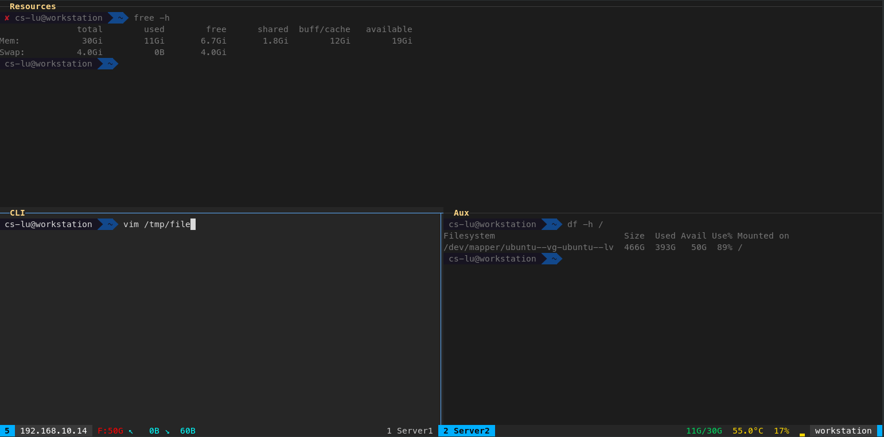

# tmux-monitor-theme  


This repo contains a useful - despite its minimalism - tmux theme.

Theme's screenshot



Works on Linux and macOS. Widgets fall back to `--` when a sensor is unavailable, so the bar never breaks.

### INSTALLATION
To install it, copy `.tmux.conf` and `tmux-functions.sh` files to your `${HOME}` directory. `INSTALL` script automates this process. Common flags:
* `INSTALL -k` — check required tools + Nerd Font
* `INSTALL -r` — check, then install missing packages
* `INSTALL -l` — symlink both files into `$HOME` (use `-c` to copy instead)
* `INSTALL -h` — full option list

### STATUS BAR
The status bar provides fast access to some system information. From left to right you will find:
* Tmux session’s name
* Local IP address (actually the first one that appears on `hostname -I` command)
* Free disk space
* Network upload/download traffic statistics
* Panes’ names
* Available Ram/Total ram
* CPU temperature (use psensors)
* CPU load
* Hostname

Threshold-based widgets (CPU load, temp, memory, disk) shift color across a green → gold → orange → red spectrum as values climb.

### COLORS
All colors live in variable blocks at the top of each file:
* `.tmux.conf` — panes, borders, message bar, clock, pane titles
* `tmux-functions.sh` — status bar background, text tiers, accent, and the threshold spectrum (`GOOD`, `COOL`, `WARN`, `WARN2`, `DANGER`)

Retune the theme by editing those blocks; no widget code needs to change.

## IMPORTANT
I use `zsh` with `oh-my-zsh` installed and `agnoster` theme on top of it. So if you want your terminal to look like the image above run also 'INSTALL -z' or execute first the following commands.
```
sudo apt-get -y install zsh
sudo apt-get -y install fonts-powerline
sh -c "$(wget https://raw.githubusercontent.com/robbyrussell/oh-my-zsh/master/tools/install.sh -O -)"
chsh -s $(which zsh)  
```
Then change in your `~/.zshrc` the theme's name to `ZSH_THEME="agnoster"`.
